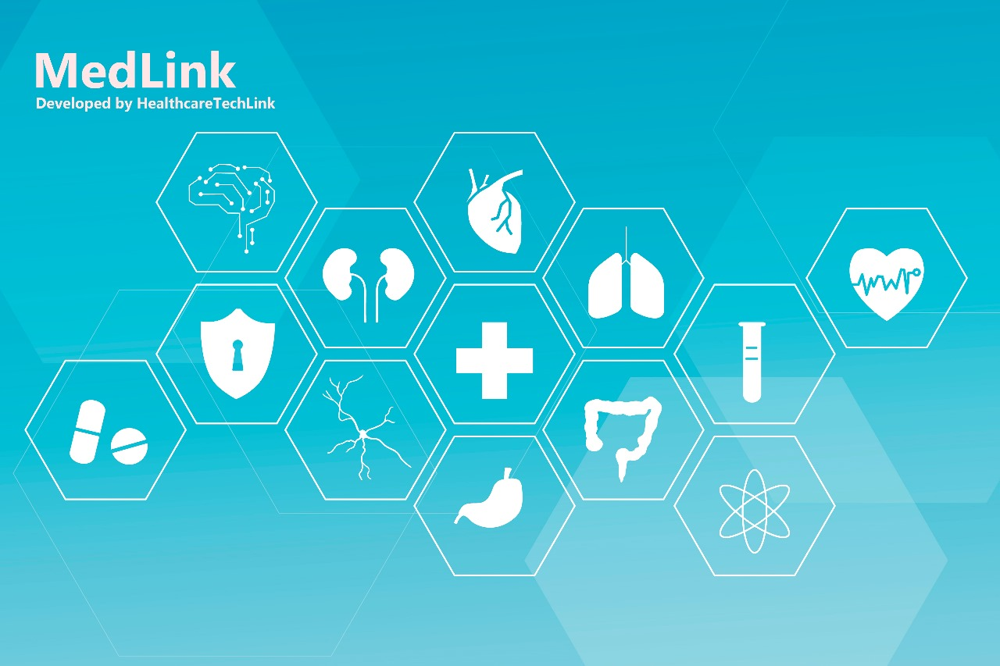

# MedLink

Imagine uma plataforma que quebra barreiras e conecta médicos, especialistas e terapeutas em um esforço colaborativo inovador. Apresentamos o MedLink, o divisor de águas na gestão de tratamentos médicos.

Possivelmente você conhece algum tratamento que gerou confusão quando múltiplos profissionais de saúde estão envolvidos em um tratamento complexo. Erros, tratamentos duplicados e comunicação desordenada afetam negativamente a qualidade do cuidado. O MedLink visa resolver isso.

Nossa plataforma cria uma ponte entre especialistas, permitindo uma colaboração perfeita. Sanando à falta de comunicação e disponibilizando uma gestão de tratamento integrada.

Principais Recursos do MedLink:
Perfil de Paciente Centralizado: Com o MedLink, cada paciente tem um painel central que reúne todas as informações críticas. Histórico médico, resultados de testes, tratamentos passados e presentes - tudo à sua disposição com um clique.

Acesso do Paciente: Não é apenas para os profissionais. Os pacientes também podem acessar a plataforma, visualizando seu histórico médico e até agendando consultas.

Alertas e Notificações Inteligentes: O MedLink não deixa passar nada despercebido. Alertas automáticos mantêm os profissionais informados sobre mudanças críticas no tratamento. Isso garante ação rápida e decisões informadas.

Com o MedLink, estamos transformando a experiência do tratamento médico. Da comunicação fragmentada à colaboração perfeita, estamos abrindo caminho para um novo paradigma de cuidados de saúde.

Junte-se a nós na revolução da HealthcareTechLink e descubra como o MedLink está redefinindo a maneira como tratamentos médicos são administrados. Juntos, estamos construindo um futuro mais saudável e conectado.

A MedLink é a solução para a coordenação eficiente no complexo mundo dos tratamentos médicos.

